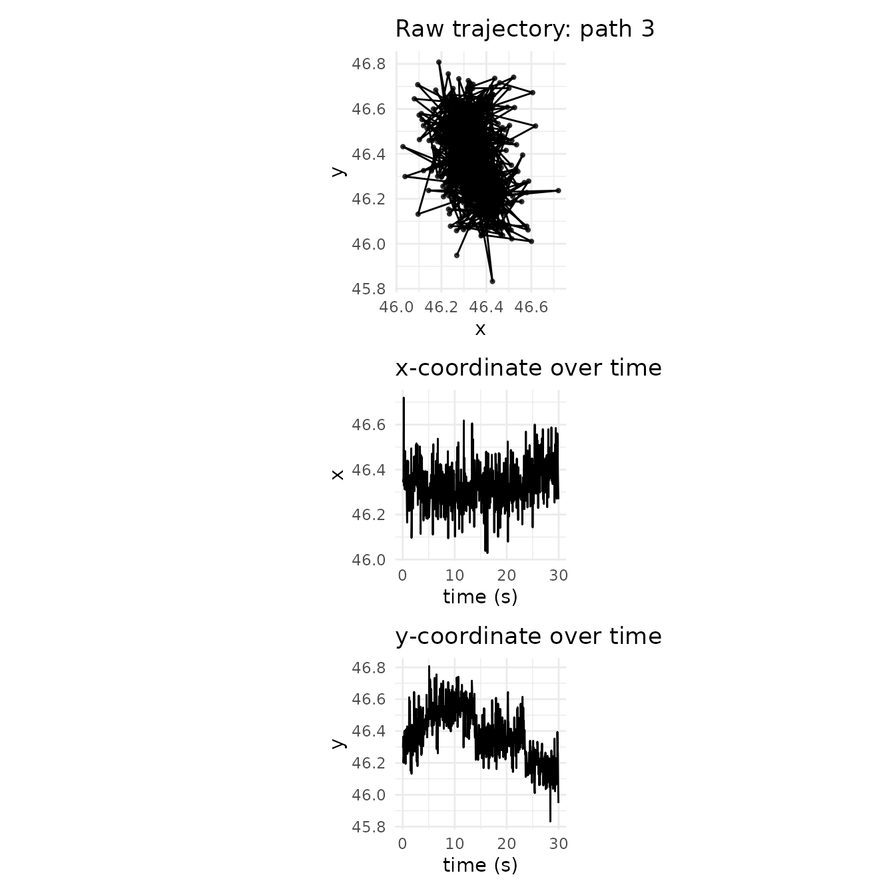
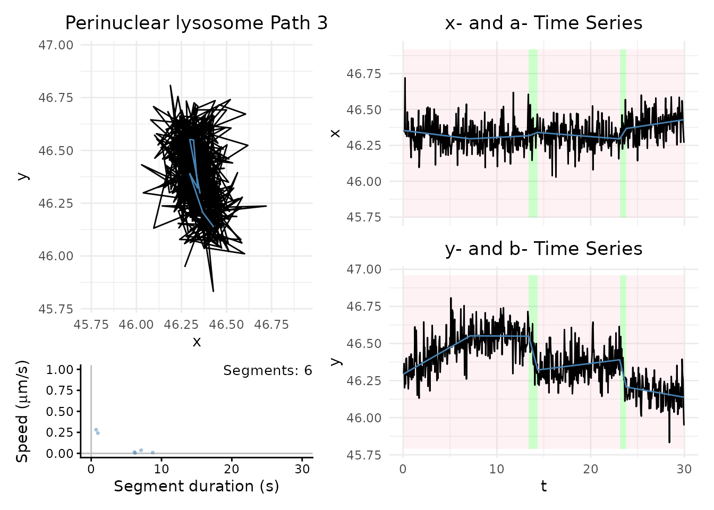
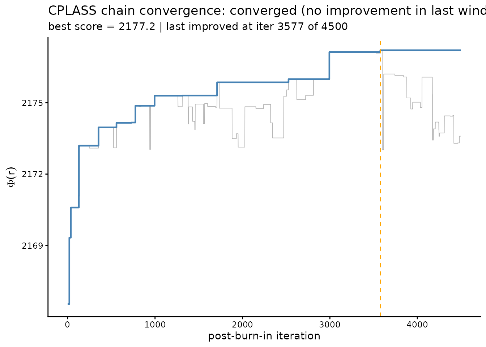
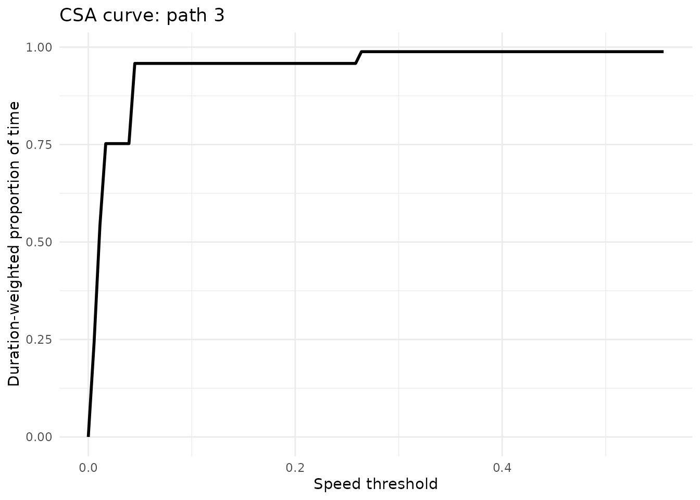

# Getting started with CPLASS

## Overview

**CPLASS** (Continuous Piecewise-Linear Approximation via Stochastic
Search) detects changes in velocity within multidimensional particle
trajectories. Unlike traditional changepoint methods that target changes
in *mean*, CPLASS models a *continuous* piecewise-linear anchor
trajectory and searches the space of changepoint configurations with a
tailored Metropolis-Hastings sampler. See Do et al. (2026),
*Change-in-velocity detection in multidimensional data*, for the full
statistical model and simulation studies behind the method.

This vignette walks through:

1.  loading the package and an example trajectory data set;
2.  running CPLASS on a single path;
3.  visualizing the inferred continuous piecewise-linear anchor path;
4.  checking whether the search has stabilized, and running multiple
    independent starts for a more reliable fit;
5.  summarizing a fitted trajectory with the Cumulative Speed Allocation
    (CSA); and
6.  running CPLASS on a small collection of paths at once.

CPLASS is a stochastic *search* for the configuration that maximizes a
penalized criterion, not a Bayesian sampler in the usual sense. So
“convergence” below always means **optimization has stabilized** (no
better configuration is being found), not that a Markov chain has
reached a stationary posterior distribution.

## 1. Load the package

``` r

library(cplass)
library(ggplot2)
library(dplyr)
library(patchwork)
```

``` r

packageVersion("cplass")
```

    ## [1] '0.1.1'

## 2. Load the example trajectory data

The package ships a small example data set of lysosome trajectories,
collected in the peripheral region of cells (Rayens et al. 2022). Each
row is the position of one tracked particle at one observed time point.

| Column       | Description                           |
|:-------------|:--------------------------------------|
| `index_path` | Trajectory identifier                 |
| `t`          | Observed time, in seconds             |
| `x`          | x-position of the particle ($`\mu`$m) |
| `y`          | y-position of the particle ($`\mu`$m) |

``` r

data_file <- system.file("extdata", "Real_21_Periphery.csv", package = "cplass")
traj_data <- read.csv(data_file)
str(traj_data)
```

    ## 'data.frame':    114724 obs. of  4 variables:
    ##  $ t         : num  0.05 0.1 0.15 0.2 0.25 0.3 0.35 0.4 0.45 0.5 ...
    ##  $ x         : num  3.37 3.39 3.32 3.27 3.4 ...
    ##  $ y         : num  44.4 44.5 44.4 44.3 44.4 ...
    ##  $ index_path: int  1 1 1 1 1 1 1 1 1 1 ...

Number of observations per path:

``` r

path_summary <- traj_data |>
  group_by(index_path) |>
  summarise(
    n_obs = n(),
    duration = max(t) - min(t),
    .groups = "drop"
  )
head(path_summary)
```

    ## # A tibble: 6 × 3
    ##   index_path n_obs duration
    ##        <int> <int>    <dbl>
    ## 1          1   599     29.9
    ## 2          2   599     29.9
    ## 3          3   596     29.9
    ## 4          4   599     29.9
    ## 5          5   599     29.9
    ## 6          6   599     29.9

## 3. Inspect one trajectory

We use `index_path == 3` as the running example.

``` r

path_id <- 3
path <- traj_data |> filter(index_path == path_id)

t <- path$t
x <- path$x
y <- path$y
```

``` r

p_xy <- ggplot(path, aes(x = x, y = y)) +
  geom_path() +
  geom_point(size = 0.8, alpha = 0.7) +
  coord_equal() +
  theme_minimal() +
  labs(title = paste("Raw trajectory: path", path_id), x = "x", y = "y")

p_xt <- ggplot(path, aes(x = t, y = x)) +
  geom_line() +
  theme_minimal() +
  labs(title = "x-coordinate over time", x = "time (s)", y = "x")

p_yt <- ggplot(path, aes(x = t, y = y)) +
  geom_line() +
  theme_minimal() +
  labs(title = "y-coordinate over time", x = "time (s)", y = "y")

p_xy / p_xt / p_yt
```



## 4. Run CPLASS on a single path

The main inputs are the observed time vector `t` and the coordinate
vectors `x`, `y`. Useful tuning parameters:

- `iter_max` – total number of stochastic-search iterations.
- `burn_in` – initial iterations discarded before selecting the best
  configuration.
- `s_cap` – speed above which the (optional) speed penalty is applied.
- `speed_pen` – whether to use the speed penalty (Section 2.3 of the
  paper).
- `gamma` – exponent in the strengthened SIC penalty (paper recommends
  1.01).
- `pen` – penalty choice: `"ssic"`, `"aicc"`, or `"hybrid"`.
- `patience` – if set, stop early once the criterion hasn’t improved for
  this many iterations (see
  [`?CPLASS`](https://linhdo154.github.io/cplass/reference/CPLASS-function.md)).

``` r

fit_single <- CPLASS(
  t, x, y,
  iter_max = 5000,
  burn_in = 500,
  s_cap = 1,
  gamma = 1.01,
  speed_pen = TRUE,
  pen = "ssic",
  show_progress = FALSE
)
```

The fit is a list with a tibble of inferred segments and the
reconstructed anchor path:

``` r

names(fit_single)
```

    ## [1] "segments_inferred" "path_inferred"     "best_score"       
    ## [4] "stopped_early"     "iterations_used"

``` r

fit_single$segments_inferred
```

    ## # A tibble: 6 × 7
    ##   cp_times durations states  speeds       vx        vy angles
    ##      <dbl>     <dbl>  <int>   <dbl>    <dbl>     <dbl>  <dbl>
    ## 1     7.15     7.1        0 0.0371  -0.00812  0.0362    1.79 
    ## 2    13.4      6.25       0 0.00341  0.00339 -0.000392 -0.115
    ## 3    14.4      0.950      1 0.241    0.0241  -0.240    -1.47 
    ## 4    23.1      8.75       0 0.00934 -0.00509  0.00783   2.15 
    ## 5    23.8      0.700      1 0.282    0.103   -0.262    -1.20 
    ## 6    30.0      6.15       0 0.0150   0.00994 -0.0112   -0.845

``` r

fit_single$segments_inferred |>
  summarise(
    n_segments = n(),
    total_duration = sum(durations),
    mean_speed = mean(speeds),
    max_speed = max(speeds),
    prop_motile_time = sum(durations[states == 1]) / sum(durations)
  )
```

    ## # A tibble: 1 × 5
    ##   n_segments total_duration mean_speed max_speed prop_motile_time
    ##        <int>          <dbl>      <dbl>     <dbl>            <dbl>
    ## 1          6           29.9     0.0979     0.282           0.0552

## 5. Visualize the fit

The black line is the observed trajectory; the blue line is the inferred
continuous piecewise-linear anchor path. Shaded regions mark stationary
vs. motile segments using the default speed cutoff of 0.1 $`\mu`$m/s.

``` r

max_speed <- ceiling(max(fit_single$segments_inferred$speeds))

plot_path_inferred(
  fit_single,
  motor = "Perinuclear lysosome",
  max_speed = max_speed,
  t_lim = c(0, ceiling(max(t) - min(t))),
  path_index = path_id
)
```



## 6. Has the search stabilized?

[`check_convergence()`](https://linhdo154.github.io/cplass/reference/check_convergence.md)
re-runs CPLASS with its diagnostic trace enabled and checks how long it
has been since the running-maximum criterion score last improved. This
is useful for sizing `iter_max` for trajectories of a given length – see
Figure 4 of the companion paper for why a naive gradient-based stopping
rule is not reliable here.

``` r

conv <- check_convergence(t, x, y, iter_max = 5000, burn_in = 500, show_progress = FALSE)
```

``` r

conv$converged
```

    ## [1] TRUE

``` r

conv$best_score
```

    ## [1] 2177.202

``` r

conv$last_improvement_iter
```

    ## [1] 3577

``` r

plot_convergence(conv)
```



## 7. Multiple independent starts

The penalized criterion can have several local maxima (Figure 4 of the
paper).
[`CPLASS_multistart()`](https://linhdo154.github.io/cplass/reference/CPLASS_multistart.md)
runs several independent chains and keeps the one with the highest
criterion score, using patience-based early stopping by default so the
extra starts don’t cost a full `iter_max` each.

``` r

ms <- CPLASS_multistart(
  t, x, y,
  iter_max = 5000,
  burn_in = 500,
  n_starts = 5,
  n_cores = 1,
  show_progress = FALSE
)

ms$all_scores
```

    ## [1] 2172.033 2178.168 2176.785 2169.223 2171.704

``` r

ms$score_spread
```

    ## [1] 8.945725

A small `score_spread` means the starts agree on (approximately) the
same optimum. Use the winning run for downstream analysis:

``` r

fit_best <- ms$best
fit_best$segments_inferred
```

    ## # A tibble: 6 × 7
    ##   cp_times durations states  speeds       vx       vy angles
    ##      <dbl>     <dbl>  <int>   <dbl>    <dbl>    <dbl>  <dbl>
    ## 1      6.2     6.15       0 0.0416  -0.00935  0.0406   1.80 
    ## 2     13.4     7.25       0 0.00361  0.00230  0.00278  0.878
    ## 3     14.4     0.9        1 0.261    0.0260  -0.259   -1.47 
    ## 4     23.3     8.95       0 0.00904 -0.00469  0.00773  2.12 
    ## 5     23.6     0.350      1 0.556    0.193   -0.521   -1.22 
    ## 6     30.0     6.3        0 0.0152   0.0104  -0.0111  -0.821

## 8. Cumulative Speed Allocation (CSA)

The CSA is a duration-weighted empirical distribution of inferred
segment speeds (Cook et al. 2025): for each speed threshold, the
proportion of time the particle spent moving slower than that threshold.
It summarizes an entire trajectory’s speed profile without an arbitrary
motile/stationary cutoff.

``` r

speed_mesh <- seq(0, max(fit_best$segments_inferred$speeds), length.out = 100)
csa_single <- compute_csa(fit_best$segments_inferred, speed_mesh = speed_mesh)
head(csa_single)
```

    ## # A tibble: 6 × 2
    ##         s   csa
    ##     <dbl> <dbl>
    ## 1 0       0    
    ## 2 0.00562 0.242
    ## 3 0.0112  0.542
    ## 4 0.0168  0.753
    ## 5 0.0225  0.753
    ## 6 0.0281  0.753

``` r

ggplot(csa_single, aes(x = s, y = csa)) +
  geom_line(linewidth = 1) +
  theme_minimal() +
  labs(
    title = paste("CSA curve: path", path_id),
    x = "Speed threshold",
    y = "Duration-weighted proportion of time"
  )
```



## 9. Running CPLASS on a collection of paths

For a batch of trajectories, loop over paths and collect the fits. For a
full analysis, prefer
[`CPLASS_multistart()`](https://linhdo154.github.io/cplass/reference/CPLASS_multistart.md)
per path over a single
[`CPLASS()`](https://linhdo154.github.io/cplass/reference/CPLASS-function.md)
call.

``` r

path_ids <- sort(unique(traj_data$index_path))[1:3]

fit_list <- vector("list", length(path_ids))
names(fit_list) <- paste0("path_", path_ids)

for (ii in seq_along(path_ids)) {
  id <- path_ids[ii]
  path_i <- traj_data |> filter(index_path == id)
  fit_list[[ii]] <- CPLASS(
    path_i$t, path_i$x, path_i$y,
    iter_max = 5000, burn_in = 500, show_progress = FALSE
  )
}
```

``` r

fit_summary <- lapply(seq_along(fit_list), function(ii) {
  fit <- fit_list[[ii]]
  seg <- fit$segments_inferred
  data.frame(
    index_path = path_ids[ii],
    n_segments = nrow(seg),
    total_duration = sum(seg$durations),
    mean_speed = mean(seg$speeds),
    max_speed = max(seg$speeds),
    prop_motile_time = sum(seg$durations[seg$states == 1]) / sum(seg$durations)
  )
})
do.call(rbind, fit_summary)
```

    ##   index_path n_segments total_duration mean_speed max_speed prop_motile_time
    ## 1          1         19           29.9 0.19032737 0.4770425       0.62709030
    ## 2          2          8           29.9 0.06945923 0.1561290       0.06354515
    ## 3          3          6           29.9 0.13308593 0.4942614       0.04682274

## Next steps

- See
  \[[`CPLASS()`](https://linhdo154.github.io/cplass/reference/CPLASS-function.md)\],
  \[[`CPLASS_multistart()`](https://linhdo154.github.io/cplass/reference/CPLASS_multistart.md)\],
  and
  \[[`compute_csa()`](https://linhdo154.github.io/cplass/reference/compute_csa.md)\]
  for full argument documentation.
- The companion paper (Do et al. 2026) documents the statistical model,
  the four Metropolis-Hastings proposal types, and the speed penalty in
  detail.

## References

Do, L., Do, D., Cook, K. J., Shen, Y., & McKinley, S. A. (2026).
Change-in-velocity detection in multidimensional data.

Cook, K. J., Rayens, N., Do, L., Payne, C. K., & McKinley, S. A. (2025).
Considering experimental frame rates and robust segmentation analysis of
piecewise-linear microparticle trajectories. *Mathematical Biosciences
and Engineering*, 22(10), 2595-2626.

Rayens, N. T., Cook, K. J., McKinley, S. A., & Payne, C. K. (2022).
Transport of lysosomes decreases in the perinuclear region: Insights
from changepoint analysis. *Biophysical Journal*, 121(7), 1205-1218.
